# Установка Python. Менеджеры пакетов. Виртуальное окружение. Настройка IDE

## Python

`Python` &ndash; объектно-ориентированный язык программирования с динамической типизацией.

<div align="center">
  
</div>

- [Установка](https://www.python.org/downloads/)
- [Документация](https://docs.python.org/3/library/index.html)
- [Туториал (официальный)](https://docs.python.org/3/tutorial/)

Туториалы:
- [Real Python Tutorials](https://realpython.com/)
- [Python Tutorial @ W3Schools](https://www.w3schools.com/python/)
- [Питонтьютор](https://pythontutor.ru/)
- …
- [StackOverflow](https://stackoverflow.com/questions/tagged/python) :)

<div align="center">
  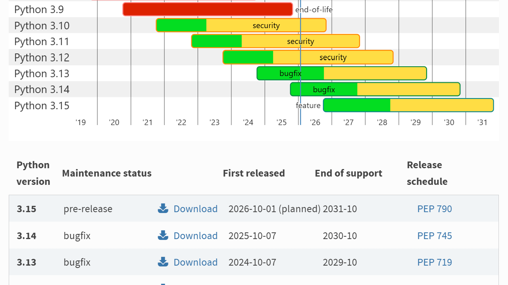
  <p style="text-align: center">
    Рисунок 1 &ndash; Активные релизы Python
  </p>
</div>

<div align="center">
  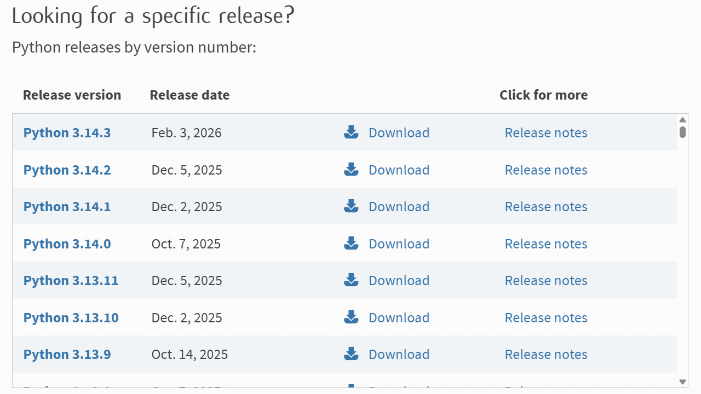
  <p style="text-align: center">
    Рисунок 2 &ndash; Релизы Python определенной версии
  </p>
</div>

## Менеджер пакетов

`PyPI` &ndash; `Python Package Index` &ndash; репозиторий «пакетов» (библиотек), написанных с использованием Python (https://pypi.org/).

<div align="center">
  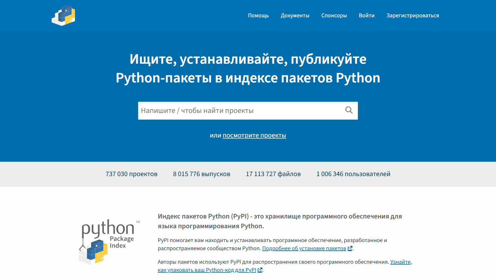
  <p style="text-align: center">
    Рисунок 3 &ndash; PyPI
  </p>
</div>

`pip` &ndash; система управления пакетами, которая используется для установки и управления программными пакетами.

<div align="center">
  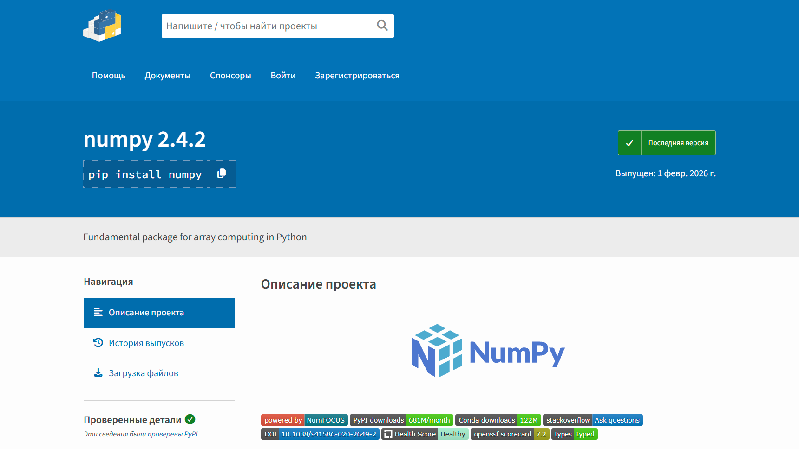
  <p style="text-align: center">
    Рисунок 4 &ndash; Описание NumPy в PyPI
  </p>
</div>

Установка `NumPy` в Linux:

```bash
pip3 install -U numpy
```

> В Ubuntu 24.04+ (Debian 12+ и основанные на нем дистрибутивы, одним из которых и является Ubuntu) использовать системный интерпретатор и, соответственно, менеджер пакетов (с `sudo` правами) для установки библиотек возбраняется (как потенциально ломающий системные зависимости подход). Рекомендуется использовать виртуальное окружение.
> 
> Вопрос на StackOverflow: [pip error on Ubuntu: externally-managed-environment × This environment is externally managed](https://askubuntu.com/questions/1465218/pip-error-on-ubuntu-externally-managed-environment-%C3%97-this-environment-is-extern).
> 
> В целом, создание виртуального окружения под новый проект приветствуется.

Установка `NumPy` в Windows:

```commandline
pip install -U numpy
```

<div align="center">
  
  <p style="text-align: center">
    Рисунок 5 &ndash; Установка пакетов
  </p>
</div>

Обновление самого `pip`:

```commandline
python.exe -m pip install --upgrade pip
```

### Менеджер пакетов UV

[UV](https://github.com/astral-sh/uv) ([сайт](https://astral.sh/)) &ndash; это быстрый пакетный менеджер Python, написанный на Rust. Разработан как замена для `pip`, `pip-tools` и других утилит.

Подробнее: [UV. Обзор пакетного менеджера Python @ Хабр](https://habr.com/ru/articles/828016/).

Установка:

```commandline
pip install uv
```

## Виртуальное окружение

Виртуальное окружение (*virtual environment*) &ndash; создание изолированного пространства для работы над конкретным проектом, что позволяет управлять его зависимостями, не влияя на другие проекты или глобальную установку Python. Физически представляет собой отдельную директорию с копиями интерпретатора и менеджера пакетов и скриптом активации виртуального окружения.

Начиная с Python 3.3, библиотека языка включает в себя модуль `venv`, который признан наиболее удобным и предпочтительным методом для этой задачи.

Создание виртуального окружения `ait-ds` (по умолчанию в Windows создастся директория в корневой папке юзера):

```commandline
uv venv ait-ds
```

Вывод:

```commandline
Using CPython 3.14.3 interpreter at: C:\Dev\Python\Python314\python.exe
Creating virtual environment at: ait-ds
Activate with: ait-ds\Scripts\activate
```

Для активации достаточно в терминале/консоли ввести:

```commandline
ait-ds\Scripts\activate
```

и после активации установить необходимые библиотеки.

## Установка библиотек

Установка библиотек с использованием `pip`:

```commandline
pip install numpy pandas matplotlib plotly scipy scikit-learn jupyterlab ipywidgets ipympl seaborn kaleido dash
```

Установка библиотек с использованием `uv`:

```commandline
uv pip install numpy pandas matplotlib plotly scipy scikit-learn jupyterlab
```

Пример выполнения установки пакета `dash`:

```commandline
(ait-ds) C:\Users\UD>uv pip install dash
Using Python 3.14.3 environment at: ait-ds
Resolved 23 packages in 817ms
Prepared 9 packages in 579ms
Installed 9 packages in 260ms
 + blinker==1.9.0
 + click==8.3.1
 + dash==4.0.0
 + flask==3.1.2
 + importlib-metadata==8.7.1
 + itsdangerous==2.2.0
 + retrying==1.4.2
 + werkzeug==3.1.5
 + zipp==3.23.0
```

## IDE

### JupyterLab

[Установка](https://jupyter.org/install) JupyterLab:

```commandline
pip install -U jupyterlab
```

Для запуска необходимо выполнить команду в терминале/консоли/командной строке:

```commandline
jupyter lab
```

В консоли запустится веб-сервер:

<div align="center">
  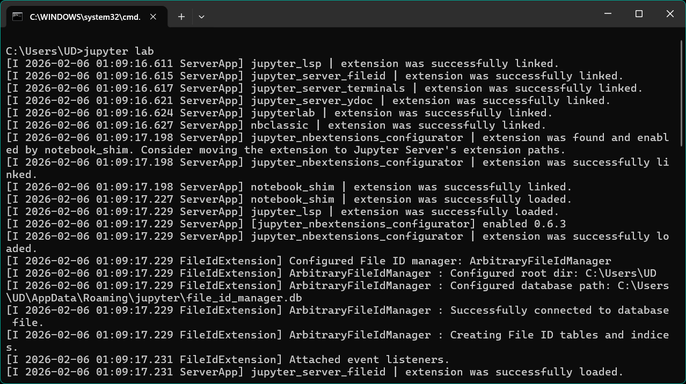
  <p style="text-align: center">
    Рисунок 6 &ndash; JupyterLab (веб-сервер)
  </p>
</div>

и откроется системный браузер или новая вкладка в текущем окне (если их несколько, то в окне, которое активно или было активным) системного браузера:

<div align="center">
  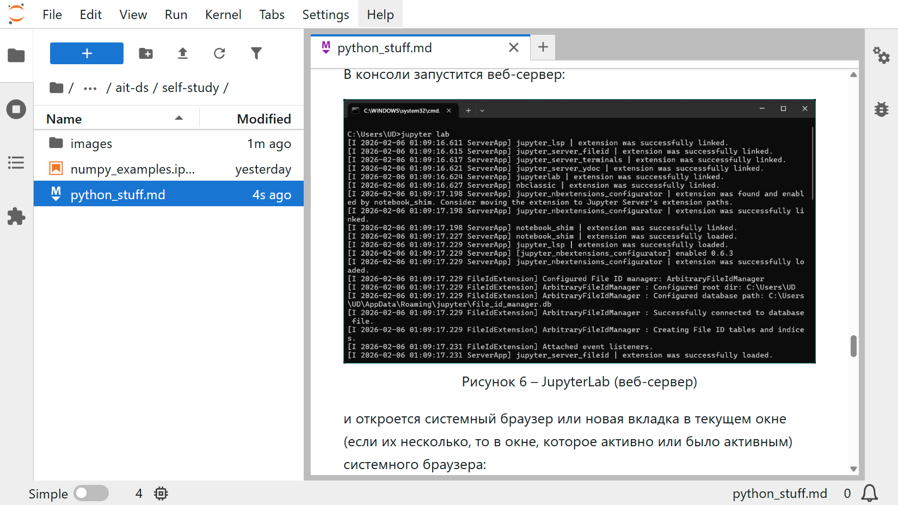
  <p style="text-align: center">
    Рисунок 7 &ndash; JupyterLab (веб-клиент)
  </p>
</div>

При этом консоль с запущенным веб-сервером должна висеть в фоне.

Отдельная IDE &ndash; [JupyterLab Desktop](https://github.com/jupyterlab/jupyterlab-desktop/releases).

<div align="center">
  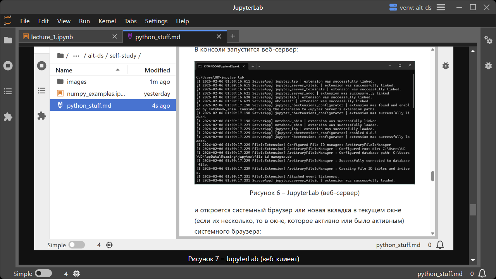
  <p style="text-align: center">
    Рисунок 8 &ndash; JupyterLab Desktop
  </p>
</div>

> JupyterLab Desktop поставляется с предустановленным браузерным движком для рендера питон-ноутбуков. На текущий момент активная разработка и поддержка приостановлена ([Readme проекта @ GitHub](https://github.com/jupyterlab/jupyterlab-desktop)), так что фиксы уязвимостей не выходят (например, для встроенного веб-движка). Питон-тетрадки могут содержать вставки с JS или HTML кодом, что потенциально небезопасно для слепого подписывания (*trusted notebook*) и выполнения подписанных питон-ноутбуков.


## Настройка IDE

### JupyterLab Desktop

Для указания интерпретатора Python из виртуального окружения необходимо на стартовом экране в меню выбрать `Manage Python environments`:

<div align="center">
  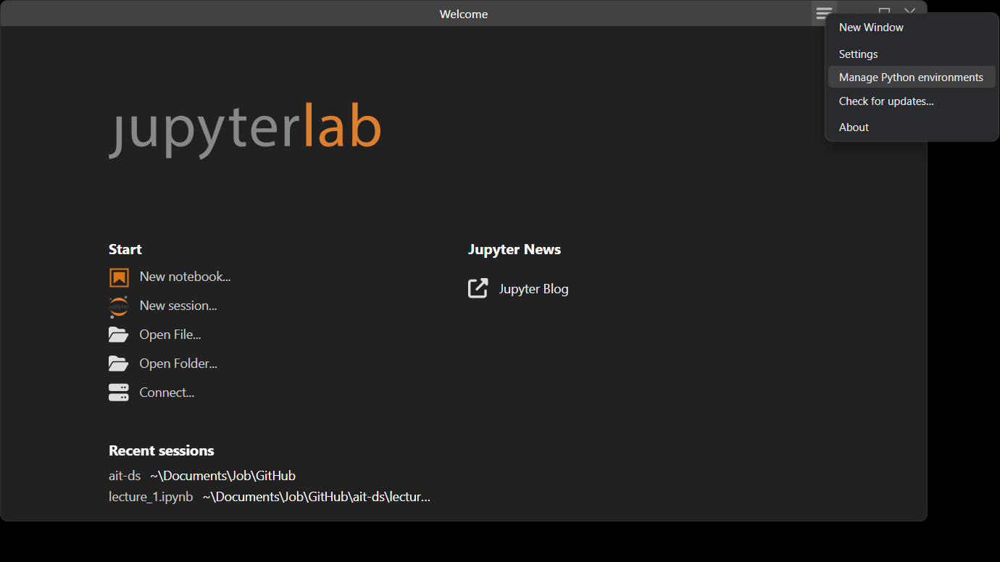
  <p style="text-align: center">
    Рисунок 9 &ndash; JupyterLab Desktop &rarr; `Manage Python environments`
  </p>
</div>

Далее необходимо указать путь до бинарника интерпретатора (`Add existing`)

<div align="center">
  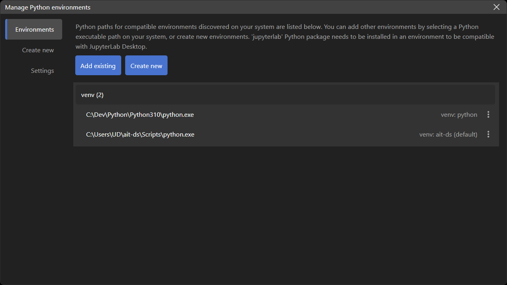
  <p style="text-align: center">
    Рисунок 10 &ndash; JupyterLab Desktop &rarr; Manage Python environments
  </p>
</div>

`Settings` в данном диалоговом окне должен выглядеть как-то так:

<div align="center">
  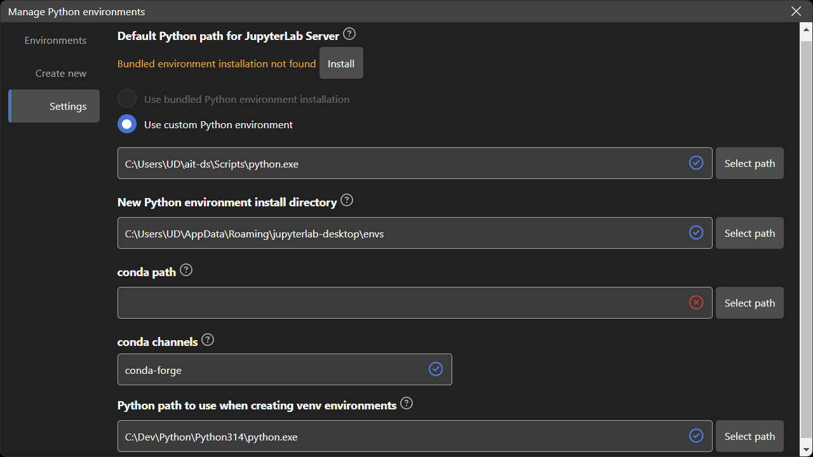
  <p style="text-align: center">
    Рисунок 11 &ndash; JupyterLab Desktop &rarr; Manage Python environments &rarr; Settings
  </p>
</div>

### VS Code

В командной панели (`Ctrl`+`Shift`+`P`) найти команду `Python: Select Interpreter`:

<div align="center">
  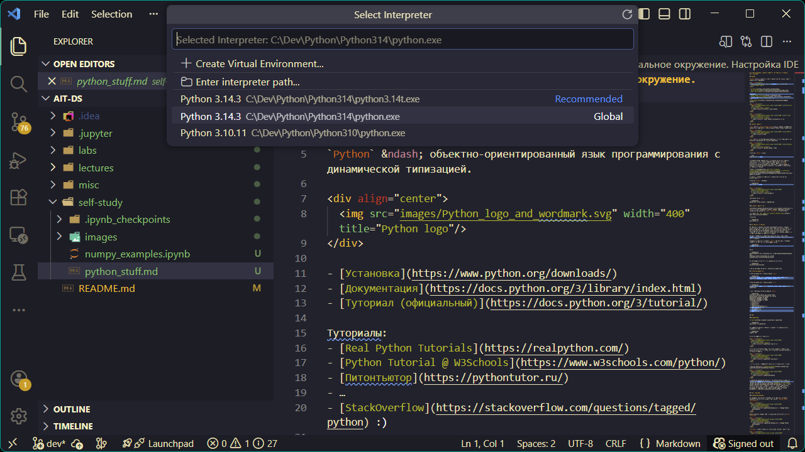
  <p style="text-align: center">
    Рисунок 12 &ndash; VS Code &rarr; Python: Select Interpreter
  </p>
</div>

Далее нажать `Enter intepreter path...` и указать путь до бинарника интерпретатора виртуального окружения. Тогда при открытии питонячего скрипта или питон-тетрадки можно указать интерпретатор `Select Kernel` &rarr; `Python Environments...` &rarr; `искомый интерпретатор`:

<div align="center">
  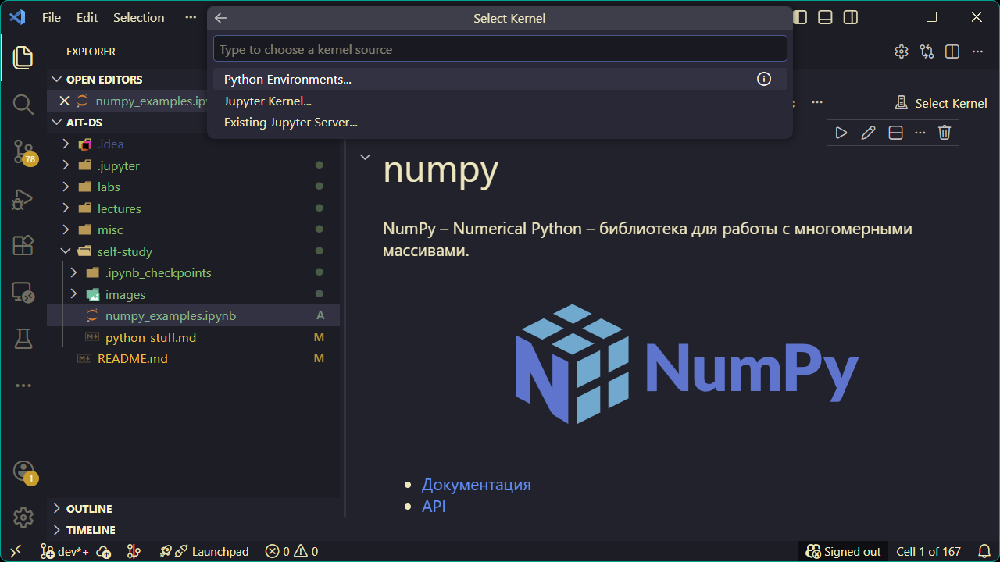
  <p style="text-align: center">
    Рисунок 13 &ndash; VS Code &rarr; Select Kernel
  </p>
</div>

<div align="center">
  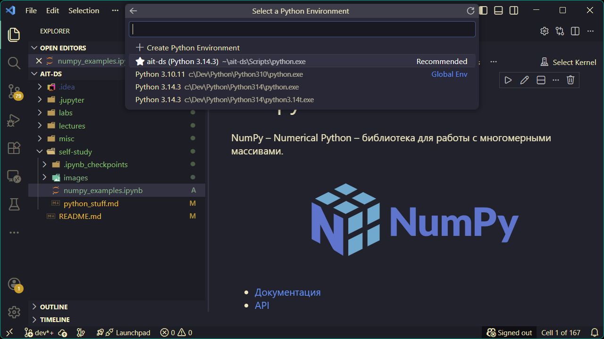
  <p style="text-align: center">
    Рисунок 14 &ndash; VS Code &rarr; Select Kernel &rarr; Python Environments...
  </p>
</div>

<div align="center">
  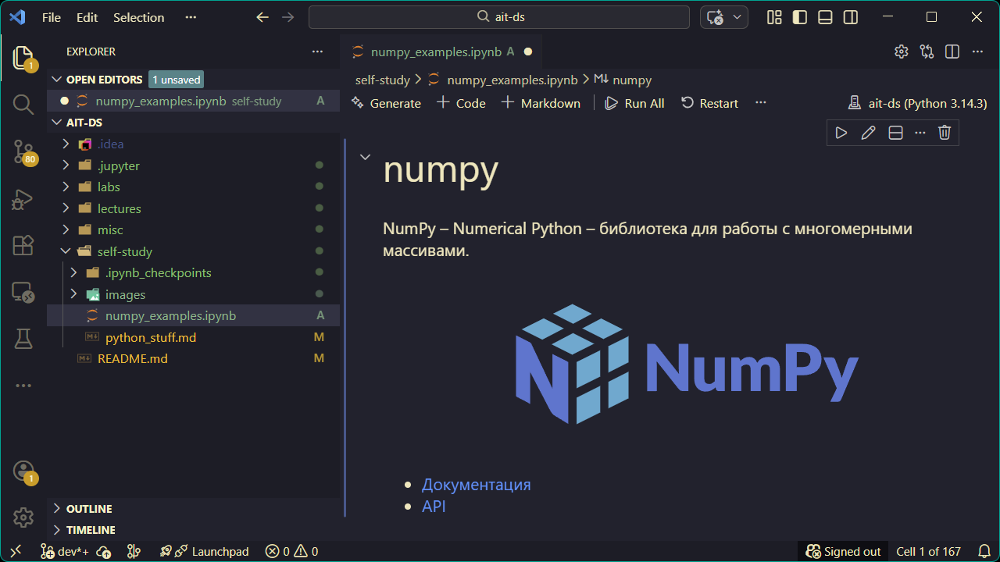
  <p style="text-align: center">
    Рисунок 15 &ndash; VS Code: выбранный интерпретатор (ait-ds)
  </p>
</div>

### PyCharm

> Скриншоты приведены для PyCharm Pro 2022.3.3.

`File` &rarr; `Settings...` &rarr; `Project: <имя проекта>` &rarr; `Python Interpreter`:

<div align="center">
  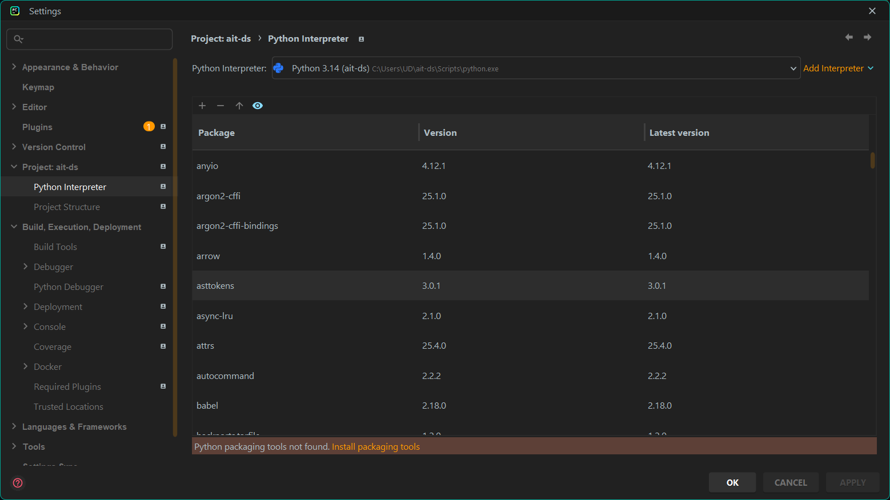
  <p style="text-align: center">
    Рисунок 16 &ndash; PyCharm: Settings &rarr; Python Interpreter
  </p>
</div>

В выпадающем списке выбрать `Show All...`:

<div align="center">
  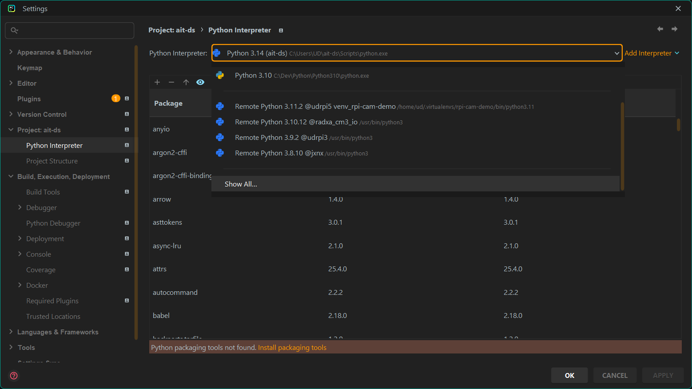
  <p style="text-align: center">
    Рисунок 17 &ndash; PyCharm: Settings &rarr; Python Interpreter
  </p>
</div>

Далее `+`:

<div align="center">
  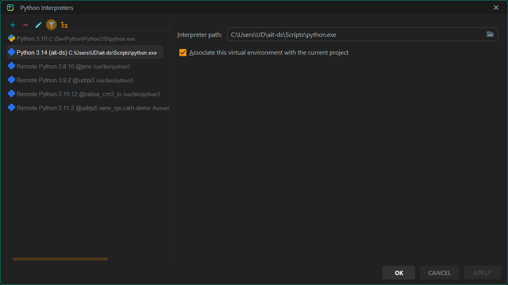
  <p style="text-align: center">
    Рисунок 18 &ndash; PyCharm: Python Interpreters
  </p>
</div>

Далее `Add Local Interpreter...`:

<div align="center">
  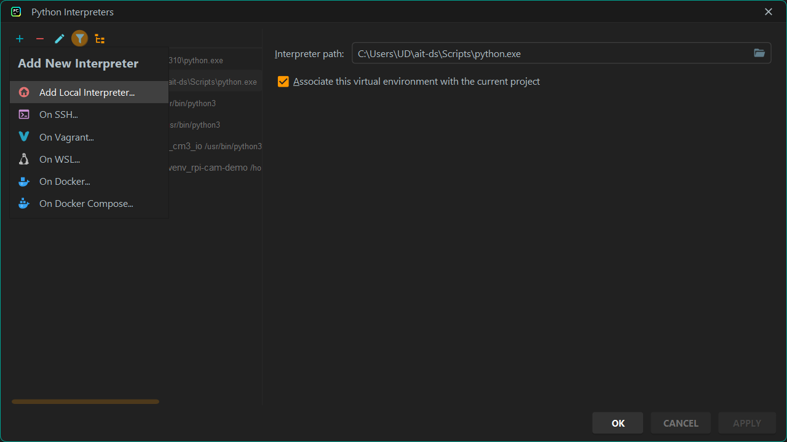
  <p style="text-align: center">
    Рисунок 19 &ndash; PyCharm: Python Interpreters
  </p>
</div>

Далее во вкладке `Virtualenv Environment` добавить существующий по кнопке `...` (указать путь до бинарника интерпретатора виртуального окружения):

<div align="center">
  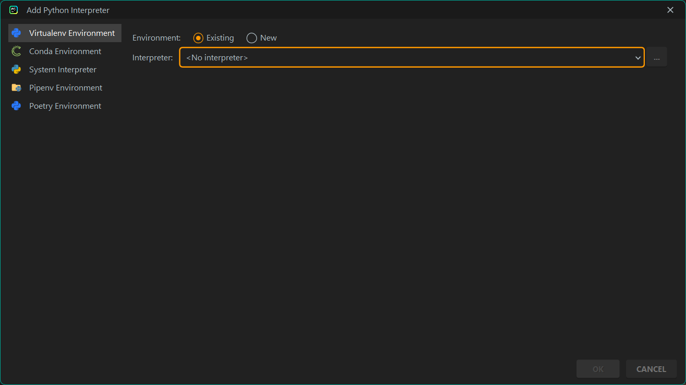
  <p style="text-align: center">
    Рисунок 20 &ndash; PyCharm: Add Python Interpreter
  </p>
</div>

<div align="center">
  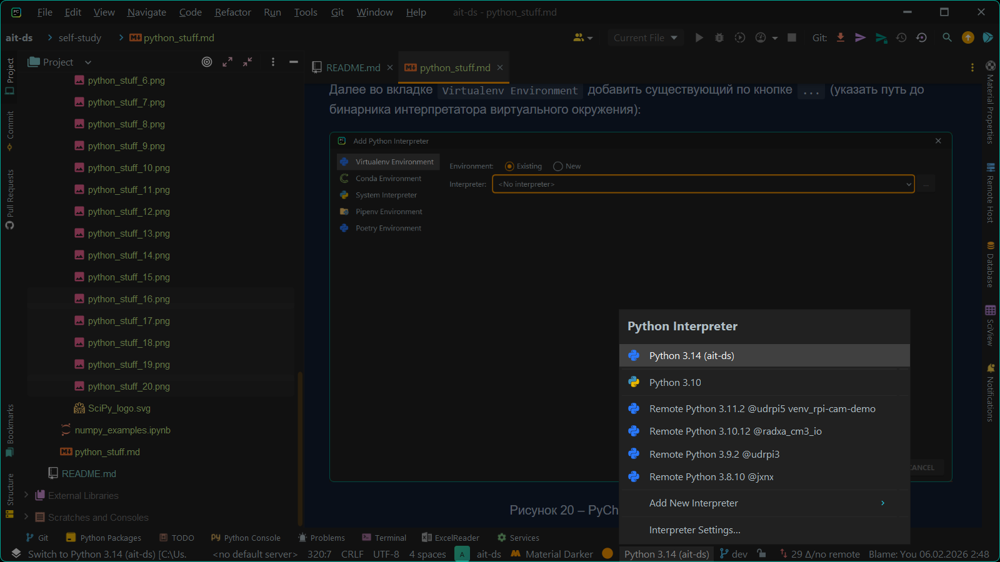
  <p style="text-align: center">
    Рисунок 21 &ndash; PyCharm: выбранный интерпретатор (ait-ds)
  </p>
</div>

## Библиотеки

### NumPy

NumPy &ndash; Numerical Python &ndash; библиотека для работы с многомерными массивами.

<div align="center">
  
</div>

- [Документация](https://numpy.org/doc/stable/)
- [API](https://numpy.org/doc/stable/reference/index.html)

[Питон-ноутбук с примерами использования numpy](numpy_examples.ipynb).

### SciPy

`SciPy` &ndash; библиотека, предназначенная для выполнения научных и инженерных расчётов.

<div align="center">
  
</div>

Ключевые особенности:
- Использует типы данных и функции NumPy
- Модуль `sparse` &ndash; работа с разреженными матрицами (плюс линейная алгебра для "sparse" данных)
- Модуль `optimize`&ndash; методы оптимизации (поиск минимумов и максимумов функций)
- Модуль `ndimage` &ndash; обработка изображений
- Модуль `fft` &ndash; БПФ
- Модуль `integrate` &ndash; вычисление интегралов
- И т.д.